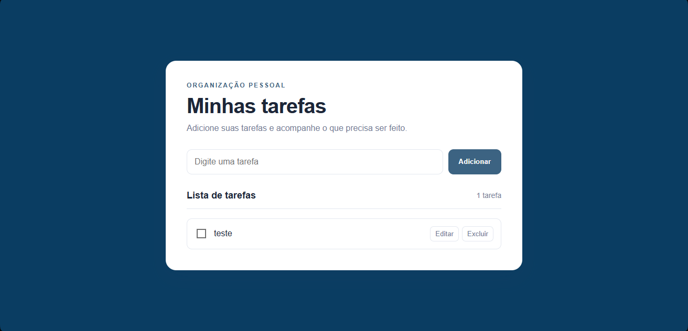

# Lista de Tarefas

Projeto desenvolvido para o desafio técnico de estágio. Aplicação de To-Do List feita com HTML, CSS e JavaScript puro.

## Como executar
1. Clone ou baixe este repositório
2. Abra o arquivo `index.html` em qualquer navegador
Não é necessário instalar dependências.

## Funcionalidades
- [x] Adicionar nova tarefa
- [x] Editar tarefa via modal
- [x] Marcar tarefa como concluída
- [x] Excluir tarefa
- [x] Contador de tarefas dinâmico

## Como o código está organizado
- `index.html`: Estrutura da página e do modal de edição
- `style.css`: Estilos, cores e responsividade
- `script.js`: Lógica da aplicação. Usa um array `tarefas` para gerenciar os dados e funções para adicionar, mostrar, concluir, editar e excluir.

## Observações
Este projeto não utiliza `localStorage`. Por isso, as tarefas ficam salvas apenas enquanto a página estiver aberta e são perdidas ao atualizar.

**Futuras melhorias:**
- Implementar `localStorage` para persistir os dados
- Adicionar filtro por "Todas / Pendentes / Concluídas"

## O que aprendi
Pratiquei manipulação de DOM, criação de modal do zero com CSS/JS, organização de código em funções e tratamento de estado vazio da lista.